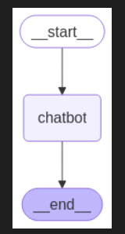
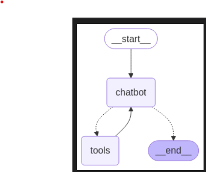

# LangGraph
This particular repo will contain all my LangGraph Projects.

There are two .ipynb files
1. ChatBot without any tool and a simple one 

2. ChatBot with Tools -- having various Wrappers like the wiki search and 

There is the requirements file Brefore runniong the .ipynb files , Run the command "pip install -r requirements.txt " on the Command terminal to load all the dependencies.